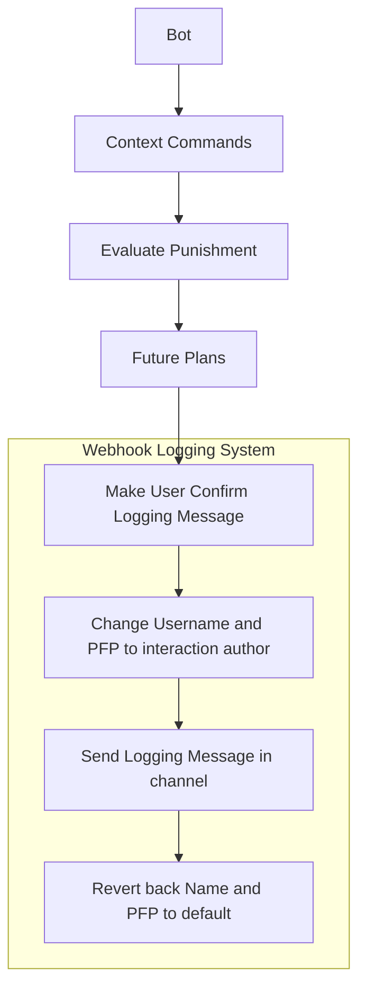

```mermaid
flowchart TB
 subgraph s1["Webhook Logging System"]
        n8["Change Username and PFP to interaction author"]
        n10["Send Logging Message in channel"]
        n11["Revert back Name and PFP to default"]
        n7["Make User Confirm Logging Message"]
  end
    n1["Bot"] --> n2["Context Commands"]
    n2 --> n3["Evaluate Punishment"]
    n3 --> n4["Future Plans"]
    n4 --> n7
    n7 --> n8
    n8 --> n10
    n10 --> n11

    n1@{ shape: rect}
```
